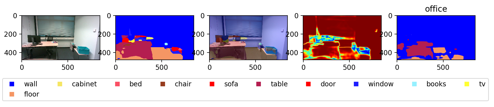
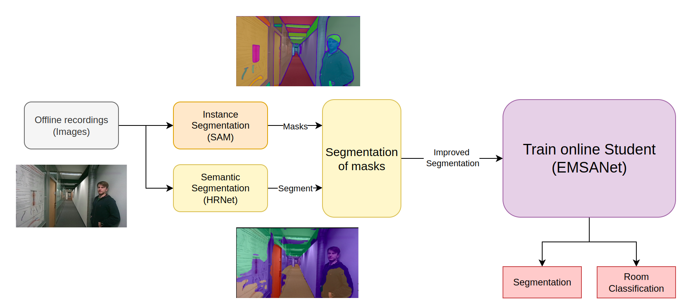

# Drone Semantic Segmentation
- Problem:
  - Models Not trained on flying viewpoints and different domains
  - High-performing models are not feasible for Jetson
  
- Goal: Offline Teacher-Student framework to distill better segmentation, that can run online

# Online pre-trained Student (EMSANet)

- 
 
- [x] Runnable on Jetson
- [x] Dockerfile
- [ ] TensorRT support
- [ ] ONNX support 

# Offline Teachers (HRNet, SAM)
- [x] [HRNet](https://github.com/HRNet/HRNet-Semantic-Segmentation)
- [x] [SAM](https://github.com/facebookresearch/segment-anything)

# Pipeline

- Produce masks and semantic segmentation from pre-trained networks
- Use the masks from High-performing Transformer to generate reliable masks, that inherit the segmentation
- The output is the refined (improved on different viewpoints) segmentation as a pseudo label
- Pseudo labels are used for training the online student model

# TODO
- [ ] Videos of segmentation and colored point clouds
- [ ] training and inference scripts
- [ ] fluent pipeline scripts with SAM
- [ ] bash scripts for downloading the data, models
- [ ] full sequence example on cor1 sequence
- [ ] Localization with Neural scene flow prior and Kabsch codes
- [ ] Script for propagating the masks to point clouds

